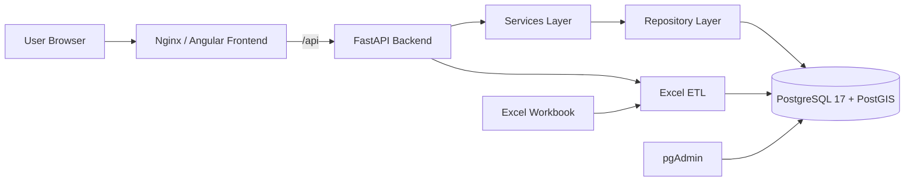

# Architecture

CCAP is split into independently deployable frontend, backend, and database layers. The MVP keeps implementation modular so future PCC, RCC, ECC, scenario, GIS, GeoServer, ArcGIS, AI prediction, and DSS modules can be added with minimal refactoring.

## Backend Layers

| Layer | Path | Responsibility |
| --- | --- | --- |
| API | `backend/app/api/routes` | HTTP endpoints and request dependencies |
| Services | `backend/app/services` | Business logic, dashboard aggregation, map GeoJSON, ETL |
| Repositories | `backend/app/repositories` | SQLAlchemy query and persistence access |
| Models | `backend/app/models` | SQLAlchemy entities and PostGIS geometry |
| Schemas | `backend/app/schemas` | Pydantic response/request contracts |
| Core | `backend/app/core` | Config, database, security, auth dependencies |

## Frontend Modules

| Page | Path | Purpose |
| --- | --- | --- |
| Login | `frontend/src/app/features/login` | JWT authentication |
| Executive Dashboard | `features/dashboard` | KPI cards and summary charts |
| GIS Map | `features/map` | OpenLayers point map and popups |
| Population Analytics | `features/population` | Population trend and ranking charts |
| Capacity Analytics | `features/capacity` | PCC, RCC, ECC, current vs optimum |
| Zoning Analytics | `features/zoning` | Land use and zoning analysis |
| Data Management | `features/data-management` | Imported data, history, Excel re-import |

## Future Integration Points

- PCC/RCC/ECC calculation engines: add service modules under `backend/app/services`.
- Scenario simulation: add scenario tables and route modules without changing existing dataset APIs.
- GeoServer/ArcGIS: expose PostGIS layers through dedicated integration services.
- WMS/WFS/WMTS: extend `MapService.layers()` and Nginx proxy rules.
- AI prediction/DSS: add model output tables and dashboard route modules.

