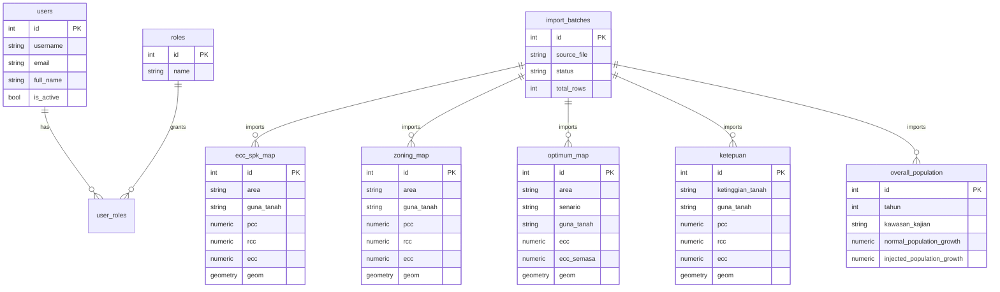

# Database Schema

The database uses PostgreSQL 17 with PostGIS enabled.

## Core Tables

| Table | Purpose |
| --- | --- |
| `users` | Authenticated platform users |
| `roles` | RBAC roles: Admin, Planner, Analyst, Viewer |
| `user_roles` | Many-to-many user role assignment |
| `import_batches` | ETL activity logs and row counts |

## Imported Workbook Tables

| Sheet | Table |
| --- | --- |
| ECC SPK MAP | `ecc_spk_map` |
| ZONING MAP | `zoning_map` |
| OPTIMUM MAP | `optimum_map` |
| KETEPUAN | `ketepuan` |
| OVERALL POPULATION | `overall_population` |

## Superset Analytics Views

| View | Purpose |
| --- | --- |
| `superset_executive_kpi` | One-row executive KPI summary |
| `superset_executive_area` | PCC, RCC, ECC, population, and status by area |
| `superset_population_trend` | Time-ready population growth series |
| `superset_land_use_summary` | Aggregated land-use area and capacity metrics |

## Schema Diagram

## Shared ETL Fields

All imported tables include:

- `id`
- `source_row`
- `source_record_hash`
- `import_batch_id`
- `raw_data`
- `created_at`
- `updated_at`

Coordinate-based tables also include:

- `latitude`
- `longitude`
- `geom geometry(Point, 4326)`

## GIS Readiness

The schema is prepared for:

- GeoJSON output from `/api/map/points`
- PostGIS spatial queries
- Future polygon layers
- Shapefile ingestion
- GeoServer publishing
- ArcGIS integration
- WMS, WFS, and WMTS services

## Indexes

The migration creates indexes for:

- Primary keys
- Area and land use filters
- PCC, RCC, ECC metrics
- Population fields
- Latitude and longitude
- PostGIS geometry through GeoAlchemy/PostGIS
