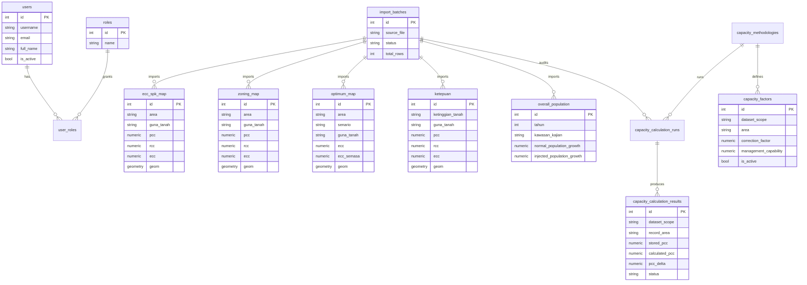

# Database Schema

The database uses PostgreSQL 17 with PostGIS enabled.

## Core Tables

| Table | Purpose |
| --- | --- |
| `users` | Authenticated platform users |
| `roles` | RBAC roles: Admin, Planner, Analyst, Viewer |
| `user_roles` | Many-to-many user role assignment |
| `import_batches` | ETL activity logs and row counts |
| `capacity_methodologies` | Active PCC/RCC/ECC formula version and JSON definition |
| `capacity_factors` | Editable `CF` and `MC` master data by dataset scope and area |
| `capacity_calculation_runs` | Formula audit/recalculation execution history |
| `capacity_calculation_results` | Row-level stored-versus-calculated PCC/RCC/ECC audit results |

## Imported Workbook Tables

| Sheet | Table |
| --- | --- |
| ECC SPK MAP | `ecc_spk_map` |
| ZONING MAP | `zoning_map` |
| OPTIMUM MAP | `optimum_map` |
| KETEPUAN | `ketepuan` |
| OVERALL POPULATION | `overall_population` |

## Superset Analytics Views

| View | Purpose |
| --- | --- |
| `superset_executive_kpi` | One-row executive KPI summary |
| `superset_executive_area` | Area-level PCC, RCC, ECC, load, saturation, balance, and status |
| `superset_population_trend` | Time-ready population growth series |
| `superset_land_use_summary` | Aggregated land-use area and capacity metrics |
| `superset_capacity_audit_summary` | Formula audit pass/warning/fail summary by run, dataset, and area |

## Capacity Formula Audit

Formula engine v1 keeps imported workbook values intact and writes calculated values to audit tables.

```text
A_msq = A_ha * 10000
PCC = ROUND((A_msq / Au) * Rf, 0)
RCC = ROUND(PCC * CF, 0)
ECC = ROUND(RCC * MC, 0)
```

`capacity_factors.area` is matched against the imported row `area` first, then `kawasan_kajian`, then wildcard `*` if configured. Missing input produces `missing_input`; missing `CF/MC` produces `missing_factor`.

## Capacity Status

Area status is based on saturation, not average ECC:

```text
capacity_load = MAX(bil_penduduk) + MAX(bil_pengunjung)
capacity = SUM(ecc)
saturation_pct = capacity_load / capacity * 100
```

Status bands:

- `Sesuai`: saturation below 70%.
- `Sederhana`: saturation from 70% to below 100%.
- `Kritikal`: saturation at or above 100%, or load exists with zero capacity.

`bil_penduduk` and `bil_pengunjung` are repeated across detailed ECC rows, so status calculations use `MAX`, not `SUM`, for load.

## Schema Diagram



## Shared ETL Fields

All imported tables include:

- `id`
- `source_row`
- `source_record_hash`
- `import_batch_id`
- `raw_data`
- `created_at`
- `updated_at`

Coordinate-based tables also include:

- `latitude`
- `longitude`
- `geom geometry(Point, 4326)`

## GIS Readiness

The schema is prepared for:

- GeoJSON output from `/api/map/points`
- PostGIS spatial queries
- Future polygon layers
- Shapefile ingestion
- GeoServer publishing
- ArcGIS integration
- WMS, WFS, and WMTS services

## Indexes

The migration creates indexes for:

- Primary keys
- Area and land use filters
- PCC, RCC, ECC metrics
- Population fields
- Latitude and longitude
- PostGIS geometry through GeoAlchemy/PostGIS
